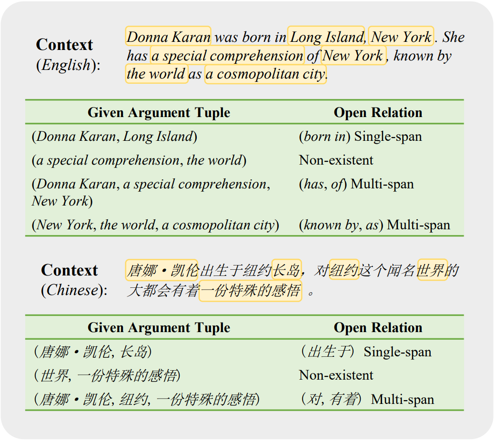

# Open Relation Extraction With Non-existent and Multi-span Relationships

This is the official code repository for "[Open Relation Extraction With Non-existent and Multi-span Relationships](https://easychair.org/publications/preprint/FbH4)" by [Huifan Yang](mailto:huifunny@bupt.edu.cn), [Da-Wei Li](mailto:daweilee@microsoft.com), [Zekun Li](mailto:lizekun@bupt.edu.cn) , [Donglin	Yang](mailto:iceberg@bupt.edu.cn) and [Bin Wu](mailto:wubin@bupt.edu.cn). 
The [video talk](https://youtu.be/LSuKfeVQ-zQ) and [slide](https://easychair.org/smart-slide/slide/x3PL) is available.
Please cite & star this work if it is useful to you.


<!--### Citation-->


## Table of contents
- [Introduction](#introduction)
    * [Task](#task)
    * [Our work](#our-work)
- [Model Usage](#model-usage)
- [Datasets](#datasets)

## Introduction
### Task
<figure>
    
    <figcaption>An illustration of our task: open relation extraction with single-span, multi-span, and non-existent relationships. (We present cases in English and Chinese due to the datasets of the two languages used in this paper.)</figcaption>
</figure>

### Our work
- We define two further tasks of open relation extraction with non-existent and multi-span relationships considering the practical demands of ORE.
- By re-constructing some existing ORE datasets, we derive and publicize four augmented datasets with non-existent relationships and a multi-span relation dataset.
- We propose a query-based multi-head framework **QuORE** to extract single/multi-span relations and detect non-existent relationships effectively. 

## Model Usage
The commands below need to be run from the root directory of the repository.

First, install prerequisites with  
```
pip install -r requirements.txt
```

* Train:  
```
allennlp train configs/[config_file] -s [model_directory] --include-package src
```

* Predict:  
```
allennlp predict [model_directory]/model.tar.gz [predict_file] --predictor machine-comprehension --cuda-device 0 --output-file [predict_directory]/predictions.jsonl --use-dataset-reader --include-package src
```

* Evaluate:  
```
allennlp evaluate [model_directory]/model.tar.gz [eval_file] --cuda-device 0 --output-file [eval_directory]/eval.json --include-package src
```

## Datasets
We publicize our re-constructed datasets in the release. The data format of training, development and test sets is the same. The data format and sample data can be found in the directory *sample_data*. 
